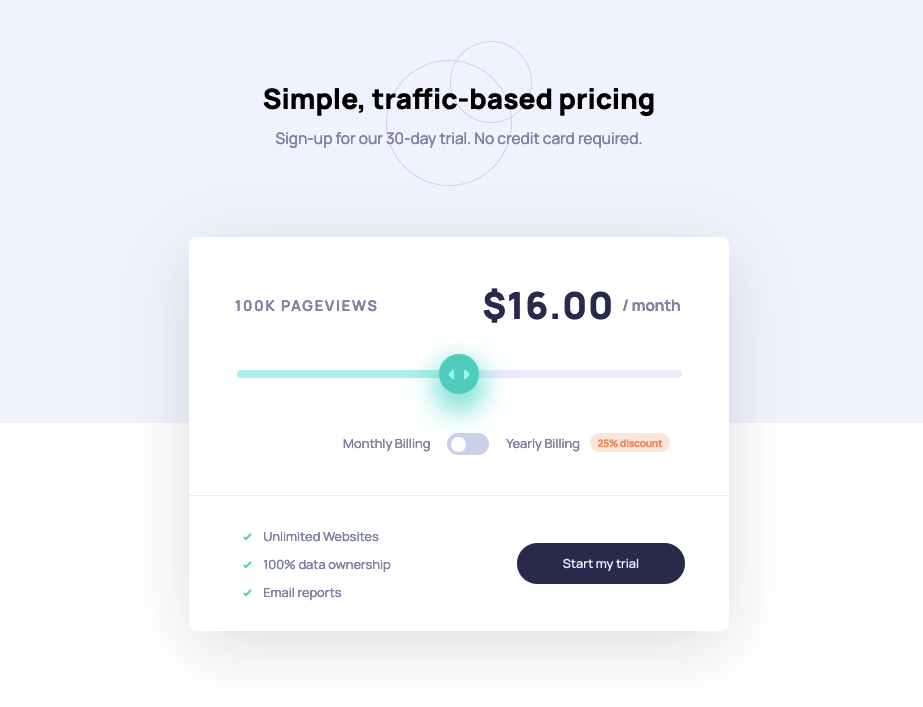

# Frontend Mentor - Interactive pricing component solution

## Hello! 👋

This is a solution to the [Interactive pricing component challenge on Frontend Mentor](https://www.frontendmentor.io/challenges/interactive-pricing-component-t0m8PIyY8). Frontend Mentor challenges help you improve your coding skills by building realistic projects. 

## Table of contents

- [Overview](#overview)
  - [The challenge](#the-challenge)
  - [Screenshot](#screenshot)
  - [Links](#links)
- [My process](#my-process)
  - [Built with](#built-with)
  - [What I learned](#what-i-learned)
  - [Useful resources](#useful-resources)
- [Author](#author)

## Overview

### The challenge

Users should be able to:

- View the optimal layout for the app depending on their device's screen size
- See hover states for all interactive elements on the page
- Use the slider and toggle to see prices for different page view numbers

### Screenshot

### Links

- Solution URL: [Github](https://github.com/aycanogut/fem-interactive-pricing-component)
- Live Site URL: [Vercel](https://fem-interactive-pricing-component-two.vercel.app/)

## My process

### Built with

- [Vite](https://vitejs.dev/)
- [SASS](https://sass-guidelin.es/)
- [Javascript](https://javascript.info/)
- [CSS Flexbox](https://css-tricks.com/snippets/css/a-guide-to-flexbox/)
- [Mobile-first workflow](https://bradfrost.com/blog/post/mobile-first-responsive-web-design/)

### What I learned

I learnt how to design range sliders and toggle-switch buttons and make it functional to manipulating DOM components. 

### Useful resources

- [css-tricks](https://css-tricks.com/styling-cross-browser-compatible-range-inputs-css/) - I used this method for style the input slider.
- [w3schools](https://www.w3schools.com/howto/howto_css_switch.asp) - I used this method for style the toggle switch.

## Author

- [Github](https://github.com/aycanogut)
- [LinkedIn](https://www.linkedin.com/in/aycanogut/)
- [Medium](https://medium.com/@aycanogut)
- [Frontend Mentor](https://www.frontendmentor.io/profile/bleedeleventh)
- [CodePen](https://codepen.io/aycanogutt)

